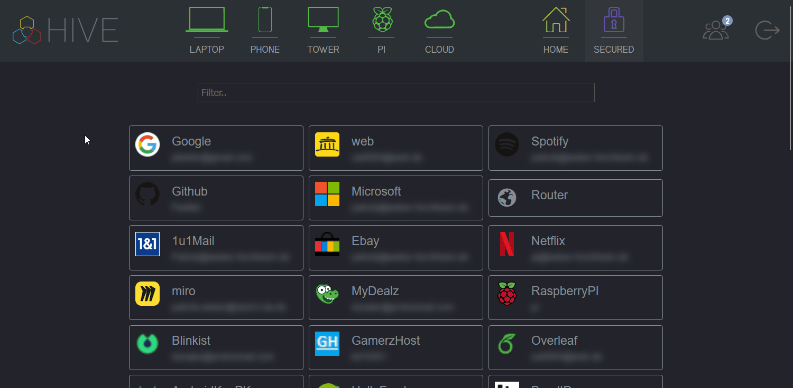

Hive is a system tailored to my personal needs. It consists of a web application that connects my devices (Windows, Linux, Android) via daemons. It uses its own protocol based on UDP and TCP for communication.

## Table of Features
- [Explorer](#explorer)
- [Remote Control](#remote-control)
- [Smart Home Dashboard](#smart-home-dashboard)
- [Password Manager](#password-manager)
- [Chatbot](#chatbot)
- [Compress](#compress)

## Explorer
Using Explorer, files can be downloaded from and uploaded to each device's file system. These actions can be shared securely via a link. Files can also be edited, renamed, copied, moved and deleted.

## Remote Control
Windows devices can be controlled remotely and interact with their clipboard. All devices can be locked, shut down or rebooted.

## Smart Home Dashboard
A simple dashboard can be used to control smart home devices connected to a Raspberry Pi with MQTT, Zigbee and Bluetooth. It can also be accessed via an Android widget and a watch face for Wear OS.

## Password Manager
The password manager encrypts (AES) and stores passwords. A password generator is also included.

## Chatbot
The chatbot can be used for general use or to take advantage of some of Hive's features, such as controlling smart home devices or making the phone ring. On Android devices, the chatbot can be quickly accessed via voice input.

## Compress
Files and folders from different devices can be compressed and merged into a single zip file that is stored in the cloud. This enables simple backup automation.

*Disclaimer: Some parts of the code have been removed due to potential abuse and to increase security.*